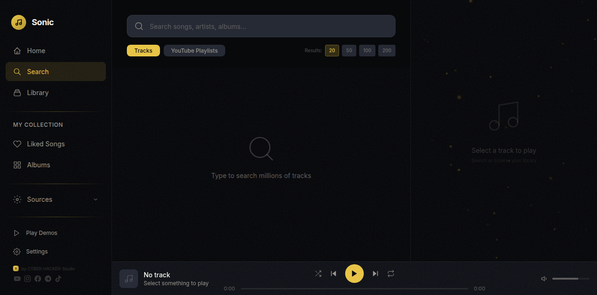

<div align="center">
  <br>
  <h1>🎵 SONIC PLAYER</h1>
  <p><b>Modern Music Streaming Application</b></p>
  <p>Search · Stream · Download · Visualize</p>
  <br>

  <!-- Badges -->
  
  
  
  
  <br><br>
  <!-- Social Links — SVG Icons -->
  <br>
  <a href="https://youtube.com/@cyberhackerstudio-k5c" target="_blank">
    <svg width="32" height="32" viewBox="0 0 24 24" fill="#808080" style="margin:0 6px;transition:fill 0.2s" onmouseover="this.fill='#ff0000'" onmouseout="this.fill='#808080'"><path d="M23.498 6.186a3.016 3.016 0 0 0-2.122-2.136C19.505 3.545 12 3.545 12 3.545s-7.505 0-9.377.505A3.017 3.017 0 0 0 .502 6.186C0 8.07 0 12 0 12s0 3.93.502 5.814a3.016 3.016 0 0 0 2.122 2.136c1.871.505 9.376.505 9.376.505s7.505 0 9.377-.505a3.015 3.015 0 0 0 2.122-2.136C24 15.93 24 12 24 12s0-3.93-.502-5.814zM9.545 15.568V8.432L15.818 12l-6.273 3.568z"/></svg>
  </a>
  <a href="https://www.instagram.com/cyberhackerstudio980" target="_blank">
    <svg width="32" height="32" viewBox="0 0 24 24" fill="#808080" style="margin:0 6px;transition:fill 0.2s" onmouseover="this.fill='#e4405f'" onmouseout="this.fill='#808080'"><path d="M12 2.163c3.204 0 3.584.012 4.85.07 3.252.148 4.771 1.691 4.919 4.919.058 1.265.069 1.645.069 4.849 0 3.205-.012 3.584-.069 4.849-.149 3.225-1.664 4.771-4.919 4.919-1.266.058-1.644.07-4.85.07-3.204 0-3.584-.012-4.849-.07-3.26-.149-4.771-1.699-4.919-4.92-.058-1.265-.07-1.644-.07-4.849 0-3.204.013-3.583.07-4.849.149-3.227 1.664-4.771 4.919-4.919 1.266-.057 1.645-.069 4.849-.069zM12 0C8.741 0 8.333.014 7.053.072 2.695.272.273 2.69.073 7.052.014 8.333 0 8.741 0 12c0 3.259.014 3.668.072 4.948.2 4.358 2.618 6.78 6.98 6.98C8.333 23.986 8.741 24 12 24c3.259 0 3.668-.014 4.948-.072 4.354-.2 6.782-2.618 6.979-6.98.059-1.28.073-1.689.073-4.948 0-3.259-.014-3.667-.072-4.947-.196-4.354-2.617-6.78-6.979-6.98C15.668.014 15.259 0 12 0zm0 5.838a6.162 6.162 0 1 0 0 12.324 6.162 6.162 0 0 0 0-12.324zM12 16a4 4 0 1 1 0-8 4 4 0 0 1 0 8zm6.406-11.845a1.44 1.44 0 1 0 0 2.881 1.44 1.44 0 0 0 0-2.881z"/></svg>
  </a>
  <a href="https://www.facebook.com/share/1D5X7FDbNh/" target="_blank">
    <svg width="32" height="32" viewBox="0 0 24 24" fill="#808080" style="margin:0 6px;transition:fill 0.2s" onmouseover="this.fill='#1877f2'" onmouseout="this.fill='#808080'"><path d="M24 12.073c0-6.627-5.373-12-12-12s-12 5.373-12 12c0 5.99 4.388 10.954 10.125 11.854v-8.385H7.078v-3.47h3.047V9.43c0-3.007 1.792-4.669 4.533-4.669 1.312 0 2.686.235 2.686.235v2.953H15.83c-1.491 0-1.956.925-1.956 1.874v2.25h3.328l-.532 3.47h-2.796v8.385C19.612 23.027 24 18.062 24 12.073z"/></svg>
  </a>
  <a href="https://t.me/cyberhackerstudio" target="_blank">
    <svg width="32" height="32" viewBox="0 0 24 24" fill="#808080" style="margin:0 6px;transition:fill 0.2s" onmouseover="this.fill='#0088cc'" onmouseout="this.fill='#808080'"><path d="M11.944 0A12 12 0 0 0 0 12a12 12 0 0 0 12 12 12 12 0 0 0 12-12A12 12 0 0 0 12 0a12 12 0 0 0-.056 0zm4.962 7.224c.1-.002.321.023.465.14a.506.506 0 0 1 .171.325c.016.093.036.306.02.472-.18 1.898-.962 6.502-1.36 8.627-.168.9-.499 1.201-.82 1.23-.696.065-1.225-.46-1.9-.902-1.056-.693-1.653-1.124-2.678-1.8-1.185-.78-.417-1.21.258-1.91.177-.184 3.247-2.977 3.307-3.23.007-.032.014-.15-.056-.212s-.174-.041-.249-.024c-.106.024-1.793 1.14-5.061 3.345-.48.33-.913.49-1.302.48-.428-.008-1.252-.241-1.865-.44-.752-.245-1.349-.374-1.297-.789.027-.216.325-.437.893-.663 3.498-1.524 5.83-2.529 6.998-3.014 3.332-1.386 4.025-1.627 4.476-1.635z"/></svg>
  </a>
  <a href="https://vt.tiktok.com/ZSCnEcBJH/" target="_blank">
    <svg width="32" height="32" viewBox="0 0 24 24" fill="#808080" style="margin:0 6px;transition:fill 0.2s" onmouseover="this.fill='#ffffff'" onmouseout="this.fill='#808080'"><path d="M12.525.02c1.31-.02 2.61-.01 3.91-.02.08 1.53.63 3.09 1.75 4.17 1.12 1.11 2.7 1.62 4.24 1.79v4.03c-1.44-.05-2.89-.35-4.2-.97-.57-.26-1.1-.59-1.62-.93-.01 2.92.01 5.84-.02 8.75-.08 1.4-.54 2.79-1.35 3.94-1.31 1.92-3.58 3.17-5.91 3.21-1.43.08-2.86-.31-4.08-1.03-2.02-1.19-3.44-3.37-3.65-5.71-.02-.5-.03-1-.01-1.49.18-1.9 1.12-3.72 2.58-4.96 1.66-1.44 3.98-2.13 6.15-1.72.02 1.48-.04 2.96-.04 4.44-.99-.32-2.15-.23-3.02.37-.63.41-1.11 1.04-1.36 1.75-.21.51-.15 1.07-.14 1.61.24 1.64 1.82 3.02 3.5 2.87 1.12-.01 2.19-.66 2.77-1.61.19-.33.4-.67.41-1.06.1-1.79.06-3.57.07-5.36.01-4.03-.01-8.05.02-12.07z"/></svg>
  </a>
  <a href="https://github.com/CYBER-HACKER-Studi0" target="_blank">
    <svg width="32" height="32" viewBox="0 0 24 24" fill="#808080" style="margin:0 6px;transition:fill 0.2s" onmouseover="this.fill='#ffffff'" onmouseout="this.fill='#808080'"><path d="M12 .297c-6.63 0-12 5.373-12 12 0 5.303 3.438 9.8 8.205 11.385.6.113.82-.258.82-.577 0-.285-.01-1.04-.015-2.04-3.338.724-4.042-1.61-4.042-1.61C4.422 18.07 3.633 17.7 3.633 17.7c-1.087-.744.084-.729.084-.729 1.205.084 1.838 1.236 1.838 1.236 1.07 1.835 2.809 1.305 3.495.998.108-.776.417-1.305.76-1.605-2.665-.3-5.466-1.332-5.466-5.93 0-1.31.465-2.38 1.235-3.22-.135-.303-.54-1.523.105-3.176 0 0 1.005-.322 3.3 1.23.96-.267 1.98-.399 3-.405 1.02.006 2.04.138 3 .405 2.28-1.552 3.285-1.23 3.285-1.23.645 1.653.24 2.873.12 3.176.765.84 1.23 1.91 1.23 3.22 0 4.61-2.805 5.625-5.475 5.92.42.36.81 1.096.81 2.22 0 1.606-.015 2.896-.015 3.286 0 .315.21.69.825.57C20.565 22.092 24 17.592 24 12.297c0-6.627-5.373-12-12-12"/></svg>
  </a>
  <br><br>

  <!-- CYBER-HACKER-Badge -->
  <sub>✦ Built by <b>CYBER · HACKER · Studio</b> ✦</sub>
</div>

<br>

---

## 📸 Screenshots

<div align="center">
  <table>
    <tr>
      <td><br><sub>Home Screen</sub></td>
      <td><br><sub>Search Results</sub></td>
    </tr>
  </table>
</div>

---

## 🎬 Promo Video

<div align="center">
  <a href="sonic_promo_final.mp4" target="_blank">
    
    <br>
    <sub>▶️ Click to watch — 40-second promo · 1920×1080</sub>
  </a>
  <br><br>
  <p><b>SONIC PLAYER</b> — Modern music streaming app built with Next.js & FastAPI</p>
  <p>🔍 Search millions of YouTube tracks · 🧠 AI smart recommendations · 📥 Offline downloads</p>
  <p>🎨 7 real-time visualizers · 📋 Playlists with album art · 📜 Synced lyrics</p>
  <p>⚡ Seamless playback with pre-buffering · 📱 Runs on Termux (Android)</p>
  <br>
  <sub>✦ by <b>CYBER · HACKER · Studio</b> ✦</sub>
</div>

---

## 🌐 Connect With Us

| Platform | Link |
|----------|------|
| 🟦 **YouTube** | [CYBER-HACKER Studio](https://youtube.com/@cyberhackerstudio-k5c) |
| 🟪 **Instagram** | [@cyberhackerstudio980](https://www.instagram.com/cyberhackerstudio980) |
| 🔵 **Facebook** | [CYBER-HACKER Studio](https://www.facebook.com/share/1D5X7FDbNh/) |
| 🔷 **Telegram** | [@cyberhackerstudio](https://t.me/cyberhackerstudio) |
| ⬛ **TikTok** | [CYBER-HACKER Studio](https://vt.tiktok.com/ZSCnEcBJH/) |
| ⭐ **GitHub** | [CYBER-HACKER-Studi0](https://github.com/CYBER-HACKER-Studi0) |

---

## ✨ Features

| Feature | Description |
|---------|-------------|
| 🔍 **YouTube Search** | Search millions of tracks. Choose 20–200 results |
| 🧠 **Smart Recommendations** | AI-powered suggestions based on listening history |
| 🎬 **YouTube Playlists** | Browse channels as playlists |
| 📥 **Offline Downloads** | Save tracks & play them without internet |
| 🎨 **7 Visualizers** | Bars, Wave, Circle, Fire, Aurora, Plasma, Rings |
| 📋 **Playlists** | Create & manage with album art thumbnails |
| 📜 **Synced Lyrics** | Auto-scrolling LRC support |
| ⚡ **Preloader** | Next track buffers while current plays — instant switching |
| 📱 **Termux Support** | Runs on Android via Termux |

---

## 🚀 Quick Start

### 🎯 One command — works on PC & Termux!

```bash
bash sonic.sh
```

ده بيعمل كل حاجة: تحديث المشروع ← تثبيت dependencies ← تشغيل backend + frontend.

أو استخدم أوامر منفصلة:

```bash
bash sonic.sh install   # تثبيت dependencies بس
bash sonic.sh update    # تحديث المشروع + تثبيت dependencies
bash sonic.sh start     # تشغيل كل حاجة
```

### Manual (PC/Linux)

```bash
git clone https://github.com/CYBER-HACKER-Studi0/Sonic-player.git
cd Sonic-player
npm install
npm run build
pip install yt-dlp --break-system-packages   # أوبونتو/ديبيان جديد
# أو: pip install yt-dlp
python3 backend/server.py &
npx next start -p 3004
```

### 📱 Termux (Android) — One command!

```bash
pkg install wget -y && wget https://raw.githubusercontent.com/CYBER-HACKER-Studi0/Sonic-player/main/setup-termux.sh && sh setup-termux.sh
```

After setup completes, start with:
```bash
sh start.sh
```

> **Note:** The new backend (server.py) uses Python stdlib only — no pydantic, fastapi, syncedlyrics, or Rust required! 🎉

Open **http://localhost:3004** in your browser.

---

## 🏗️ Project Structure

```
sonic-player/
├── app/components/      # React components (16 files)
├── backend/              # FastAPI server + downloads
├── lib/                  # State, API, storage, preloader
├── promo/                # Screenshots for README
├── demo.html             # Live demo page
├── install.sh            # Termux/Linux installer
├── start.sh              # Quick launcher
└── README.md
```

---

## 🏢 About CYBER · HACKER · Studio

**CYBER · HACKER · Studio** is an indie development studio focused on building 
modern applications and open-source tools. We specialize in:

- 📱 **Android App Development** — Native Kotlin/Jetpack Compose
- 🎵 **Media Applications** — Music streaming, video processing
- 🛠️ **Developer Tools** — CLI utilities, productivity apps
- 🌐 **Open Source** — Free tools for the community

Our mission is to build high-quality, practical software that pushes boundaries.

---

## ⚠️ Disclaimer

This project uses **yt-dlp** for educational purposes only. Users are responsible for complying with YouTube's Terms of Service. yt-dlp is optional — the app also supports Jamendo (licensed) and local file playback.

---

<div align="center">
  <sub>Built by <a href="https://github.com/CYBER-HACKER-Studi0">CYBER·HACKER·Studio</a></sub>
  <br>
  <sub>© 2026 CYBER·HACKER·Studio. All rights reserved.</sub>
</div>
