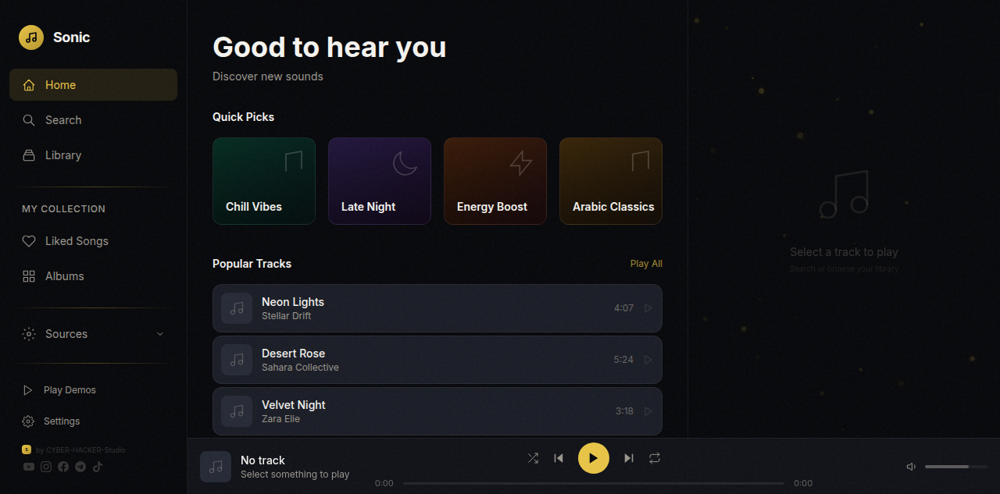
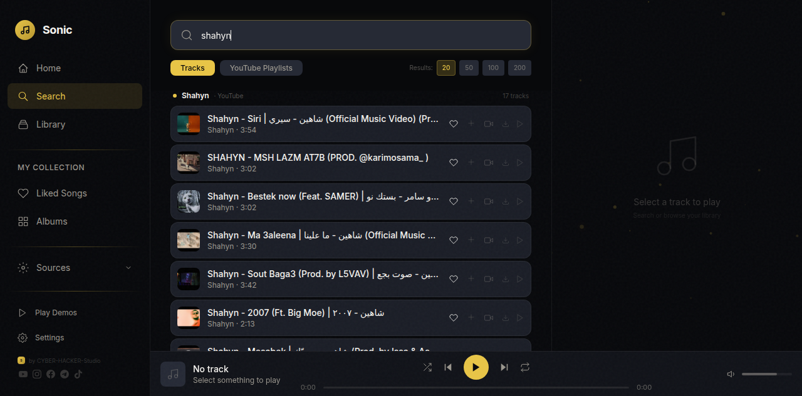
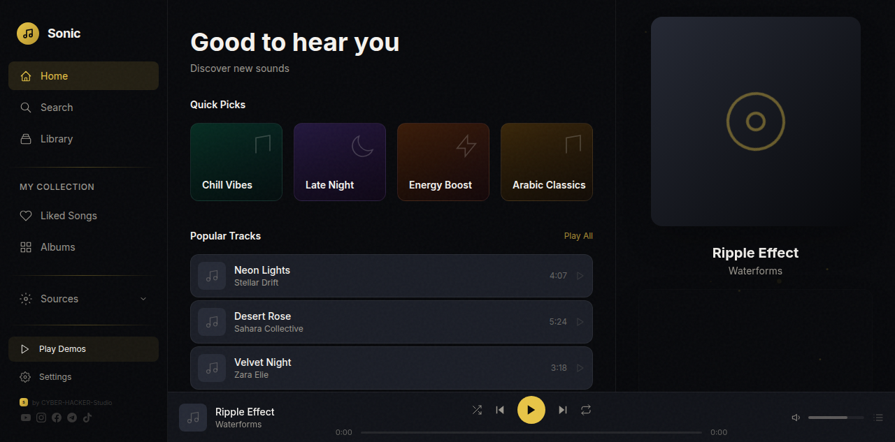
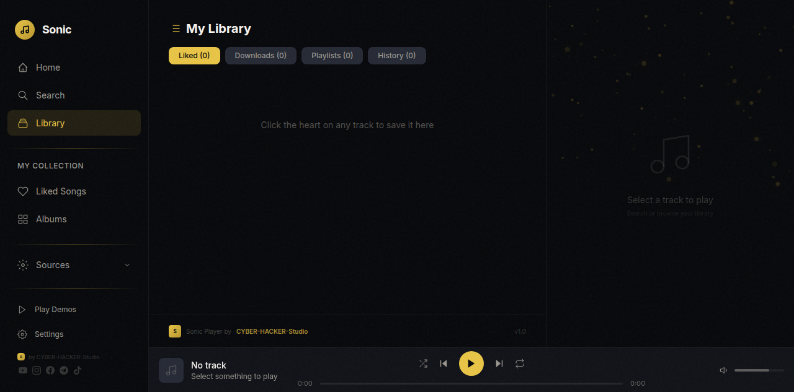

<div align="center">
  <br>
  <h1>🎵 SONIC PLAYER</h1>
  <p><b>Modern Music Streaming Application</b></p>
  <p>Search · Stream · Download · Visualize</p>
  <br>

  <!-- Badges -->
  
  
  
  
  <br><br>

  <!-- Social Links -->
  <a href="https://youtube.com/@cyberhackerstudio-k5c"></a>
  <a href="https://www.instagram.com/cyberhackerstudio980"></a>
  <a href="https://www.facebook.com/share/1D5X7FDbNh/"></a>
  <a href="https://t.me/cyberhackerstudio"></a>
  <a href="https://vt.tiktok.com/ZSCnEcBJH/"></a>
  <br><br>

  <!-- CYBER-HACKER-Badge -->
  <sub>✦ Built by <b>CYBER · HACKER · Studio</b> ✦</sub>
</div>

<br>

---

## 📸 Screenshots

<div align="center">
  <table>
    <tr>
      <td><br><sub>Home Screen</sub></td>
      <td><br><sub>Search Results</sub></td>
    </tr>
    <tr>
      <td><br><sub>Now Playing + Visualizer</sub></td>
      <td><br><sub>Library & Playlists</sub></td>
    </tr>
  </table>
</div>

---

## 🎬 Promo Video

<div align="center">
  <video src="sonic_promo_final.mp4" controls width="720" poster="promo/1_home.png">
    Your browser doesn't support video. <a href="sonic_promo_final.mp4">Download MP4</a>
  </video>
  <br>
  <sub>40-second promo · 1920×1080</sub>
</div>

---

## 🌐 Connect With Us

| Platform | Link |
|----------|------|
| 🟦 **YouTube** | [CYBER-HACKER Studio](https://youtube.com/@cyberhackerstudio-k5c) |
| 🟪 **Instagram** | [@cyberhackerstudio980](https://www.instagram.com/cyberhackerstudio980) |
| 🔵 **Facebook** | [CYBER-HACKER Studio](https://www.facebook.com/share/1D5X7FDbNh/) |
| 🔷 **Telegram** | [@cyberhackerstudio](https://t.me/cyberhackerstudio) |
| ⬛ **TikTok** | [CYBER-HACKER Studio](https://vt.tiktok.com/ZSCnEcBJH/) |
| ⭐ **GitHub** | [CYBER-HACKER-Studi0](https://github.com/CYBER-HACKER-Studi0) |

---

## ✨ Features

| Feature | Description |
|---------|-------------|
| 🔍 **YouTube Search** | Search millions of tracks. Choose 20–200 results |
| 🧠 **Smart Recommendations** | AI-powered suggestions based on listening history |
| 🎬 **YouTube Playlists** | Browse channels as playlists |
| 📥 **Offline Downloads** | Save tracks & play them without internet |
| 🎨 **7 Visualizers** | Bars, Wave, Circle, Fire, Aurora, Plasma, Rings |
| 📋 **Playlists** | Create & manage with album art thumbnails |
| 📜 **Synced Lyrics** | Auto-scrolling LRC support |
| ⚡ **Preloader** | Next track buffers while current plays — instant switching |
| 📱 **Termux Support** | Runs on Android via Termux |

---

## 🚀 Quick Start

```bash
# One-command install (recommended)
bash install.sh

# Start
bash start.sh
```

### Manual

```bash
git clone https://github.com/CYBER-HACKER-Studi0/Sonic-player.git
cd Sonic-player
npm install
npm run build
pip install -r backend/requirements.txt
python3 backend/main.py &
npx next start -p 3004
```

### Termux (Android)

```bash
pkg install nodejs python ffmpeg
git clone https://github.com/CYBER-HACKER-Studi0/Sonic-player.git
cd Sonic-player
bash install.sh
bash start.sh
```

Open **http://localhost:3004** in your browser.

---

## 🏗️ Project Structure

```
sonic-player/
├── app/components/      # React components (16 files)
├── backend/              # FastAPI server + downloads
├── lib/                  # State, API, storage, preloader
├── promo/                # Screenshots for README
├── demo.html             # Live demo page
├── install.sh            # Termux/Linux installer
├── start.sh              # Quick launcher
└── README.md
```

---

## ⚠️ Disclaimer

This project uses **yt-dlp** for educational purposes only. Users are responsible for complying with YouTube's Terms of Service. yt-dlp is optional — the app also supports Jamendo (licensed) and local file playback.

---

<div align="center">
  <sub>Built by <a href="https://github.com/CYBER-HACKER-Studi0">CYBER·HACKER·Studio</a></sub>
  <br>
  <sub>© 2026 CYBER·HACKER·Studio. All rights reserved.</sub>
</div>
